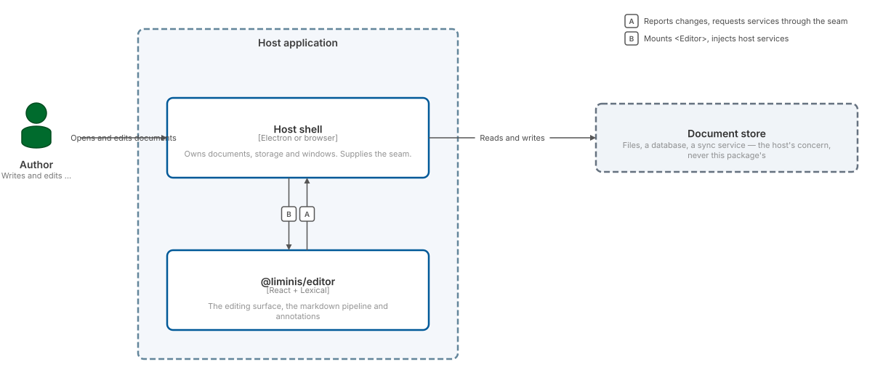
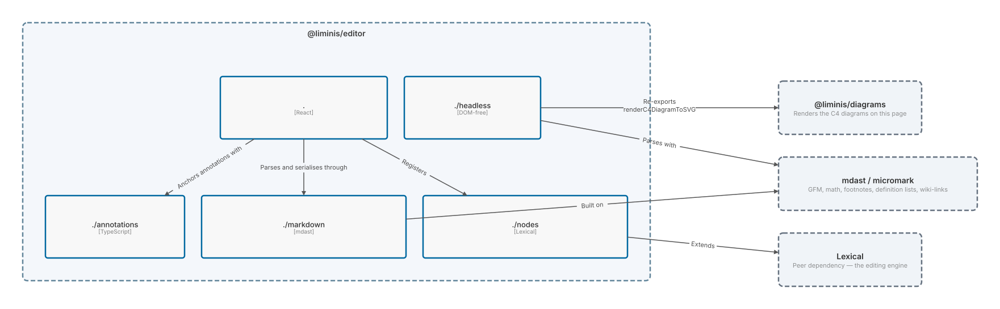

# Architecture

Which entry point to import, what each one costs you, and where the boundary
between this package and its host actually falls.

## The package and the world around it

`@liminis/editor` is a component, not an application. It has no storage, no file
dialogs, no network, and no opinion about where a document came from. Everything
it needs from its environment arrives through the host seam as an injected
function with a working default, so `<Editor>` renders in a host that supplies
nothing at all — and a host that supplies everything gets an editor wired into
its own file system, its own clipboard, and its own annotation store.

```c4 static height=24rem
Person(author, "Author", "Writes and edits markdown documents")

System_Boundary(host, "Host application") {
  Container(shell, "Host shell", "Electron or browser", "Owns documents, storage and windows. Supplies the seam.")
  Container(editor, "@liminis/editor", "React + Lexical", "The editing surface, the markdown pipeline and annotations")
}

System_Ext(store, "Document store", "Files, a database, a sync service — the host's concern, never this package's")

Rel(author, shell, "Opens and edits documents")
Rel(shell, editor, "Mounts <Editor>, injects host services")
Rel(editor, shell, "Reports changes, requests services through the seam")
Rel(shell, store, "Reads and writes")
```
<picture><source media="(prefers-color-scheme: dark)" srcset="./diagrams/architecture-1-dark.svg" /></picture>

The arrow that matters is the one from the editor back to the shell. It is not a
callback bolted on for one feature; it is how every capability the editor cannot
implement for itself is obtained. A host that ignores it still gets an editor,
because every one of those services has a default.

## Entry points

The package is split so that a consumer pays only for what it imports. The
divide that does the most work is `./headless`: it is DOM-free, which is what
lets the Electron **main** process import it at all.

```c4 static height=26rem
Container_Boundary(pkg, "@liminis/editor") {
  Component(main, ".", "React", "<Editor>, the host seam, the annotation UI")
  Component(md, "./markdown", "mdast", "parseMarkdown / stringifyMarkdown, no editor mounted")
  Component(ann, "./annotations", "TypeScript", "Range anchoring that survives edits")
  Component(headless, "./headless", "DOM-free", "Safe in an Electron main process")
  Component(nodes, "./nodes", "Lexical", "The custom node set, for a host building its own editor")
}

System_Ext(lexical, "Lexical", "Peer dependency — the editing engine")
System_Ext(mdast, "mdast / micromark", "GFM, math, footnotes, definition lists, wiki-links")
System_Ext(diagrams, "@liminis/diagrams", "Renders the C4 diagrams on this page")

Rel(main, nodes, "Registers")
Rel(main, md, "Parses and serialises through")
Rel(main, ann, "Anchors annotations with")
Rel(nodes, lexical, "Extends")
Rel(md, mdast, "Built on")
Rel(headless, diagrams, "Re-exports renderC4DiagramToSVG")
Rel(headless, mdast, "Parses with")
```
<picture><source media="(prefers-color-scheme: dark)" srcset="./diagrams/architecture-2-dark.svg" /></picture>

`./headless` re-exporting `renderC4DiagramToSVG` is the reason the two packages
appear together here: a C4 diagram in a document has to render in the main
process too, where there is no DOM, and `@liminis/diagrams/server` is DOM-free
for exactly that reason.

## What this means when you install it

- Importing `.` brings React and Lexical. That is the editor.
- Importing `./markdown` or `./annotations` brings neither. They are ordinary
  TypeScript over mdast, usable in a script or a server.
- Importing `./headless` is a promise enforced by its own doc comment: nothing
  reachable from it may touch `document`, `window`, or Lexical.
- Lexical is a **peer** dependency. The host owns the version, because a host
  that mounts its own Lexical plugins beside this editor must not end up with
  two copies of it.
