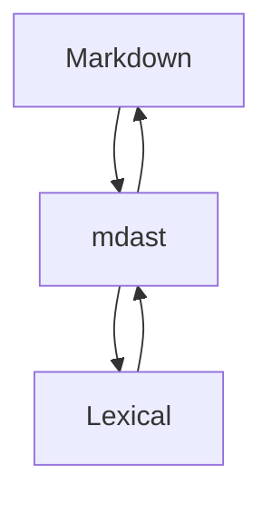

# All The Things

Every construct `@liminis/editor` supports, in one document. Select any passage
and use **Note** in the toolbar to anchor an annotation to it.

## Inline formatting

Plain text, **bold**, _italic_, ~~strikethrough~~, and `inline code`.
Combined: **bold with _nested italic_**, and **`code inside bold`** — emphasis
and strong nested, and strong wrapped directly around an inline-code span.

Escapes stay escaped: a literal \*\* beside `code`, and a backslash\_underscore.

## Links

An [inline link](https://example.com), a [link with a title](https://example.com "Hover me"),
and a bare autolink: https://example.com

Wiki-links in all three forms: [[some-note]], [[some-note|with an alias]], and
[[folder/nested-note]].

A relative document link: [the readme](./README.md), and an in-document
anchor: [jump to tables](#tables).

## Headings

### Third level

#### Fourth level

##### Fifth level

## Lists

Unordered, with nesting:

- First item
- Second item
  - Nested child
  - Another child
    - Deeper still
- Third item

Ordered:

1. First
2. Second
   1. Nested ordered
   2. And another
3. Third

Task list — unordered:

- [ ] Not done yet
- [x] Finished
- [ ] Also outstanding

Task list — ordered:

1. [ ] Not done yet
2. [x] Finished

Loose list (blank lines between items):

- One

- Two

## Definition list

Term
: The definition of that term.

Another term
: Its definition, which has **bold** and `code` in it.

## Blockquote

> A quotation. It can carry **formatting** and `code`.
>
> And span multiple paragraphs.

## Callouts

> [!NOTE]
> A note callout. This has **bold**, _italic_, and `inline code`.

> [!TIP]
> A tip callout, for advice.

> [!WARNING]
> A warning callout.
>
> With a second paragraph.

## Toggles

<details>
<summary>Click to expand</summary>

Hidden content, revealed on click. It has **formatting**, `code`, and a list:

- One
- Two

</details>

## Code

Fenced with a language, so it highlights:

```js
export function greet(name) {
  const greeting = `Hello, ${name}!`
  console.log(greeting)
  return greeting
}
```

```python
def fibonacci(n):
    a, b = 0, 1
    for _ in range(n):
        a, b = b, a + b
    return a
```

Fenced with no language:

```
plain preformatted text
  preserving   whitespace
```

## Mermaid



## C4

```c4
Person(user, "Author")
System(editor, "Liminis Editor")
System_Ext(disk, "Markdown on disk")
Rel(user, editor, "Writes in")
Rel(editor, disk, "Round-trips to")
```

## Math

Inline math: $E = mc^2$ sits in a sentence.

A display equation:

$$
\int_{-\infty}^{\infty} e^{-x^2}\,dx = \sqrt{\pi}
$$

## Tables

| Construct | Node class | Round-trips |
|---|---|---|
| Callout | `CalloutNode` | yes |
| Toggle | `ToggleContainerNode` | yes |
| Mermaid | `MermaidNode` | yes |
| C4 | `C4Node` | yes |

With alignment:

| Left | Centre | Right |
|:---|:---:|---:|
| a | b | c |

## Images

A remote image from a host that sends no `Access-Control-Allow-Origin`:


## Footnotes

A claim needing support[^1], and another[^note].

[^1]: The first footnote.
[^note]: A named footnote, with `code` in it.

## Raw HTML

<mark>Inline HTML</mark> passes through, as does <kbd>Ctrl</kbd>+<kbd>S</kbd>.

## Horizontal rule

---

## Long-form text

The remainder is ordinary prose, so the document scrolls far enough to exercise
anchor scrolling and the annotation surface over a realistic length.

Lorem one. Lorem two. Lorem three. Lorem four. Lorem five. Lorem six.
Lorem seven. Lorem eight. Lorem nine. Lorem ten. Lorem eleven. Lorem twelve.
Lorem thirteen. Lorem fourteen. Lorem fifteen. Lorem sixteen. Lorem seventeen.
Lorem eighteen. Lorem nineteen. Lorem twenty. Lorem twenty-one. Lorem twenty-two.

The quick brown fox jumps over the lazy dog, and then it rests. Select this
sentence and click **Note** to anchor a comment to it.
